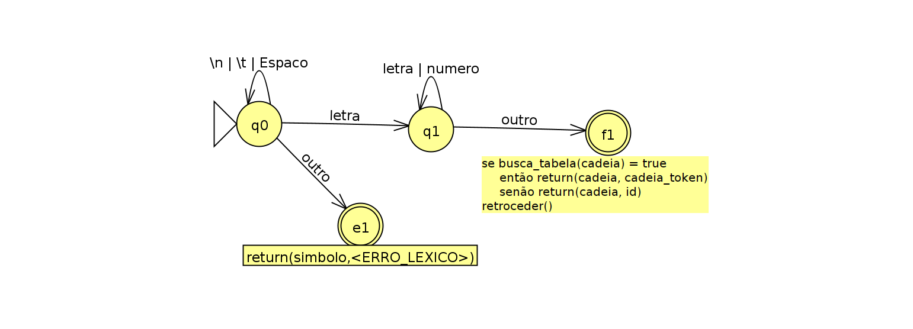
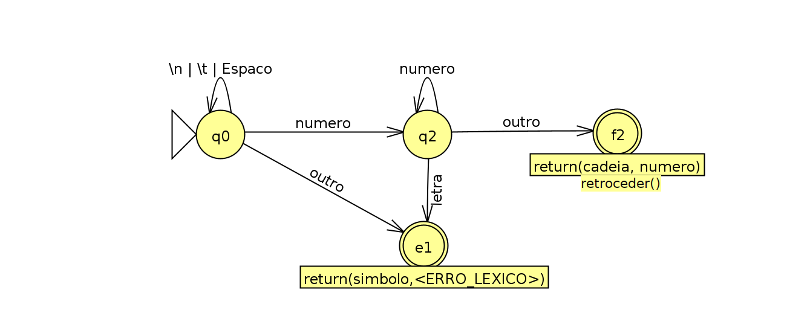
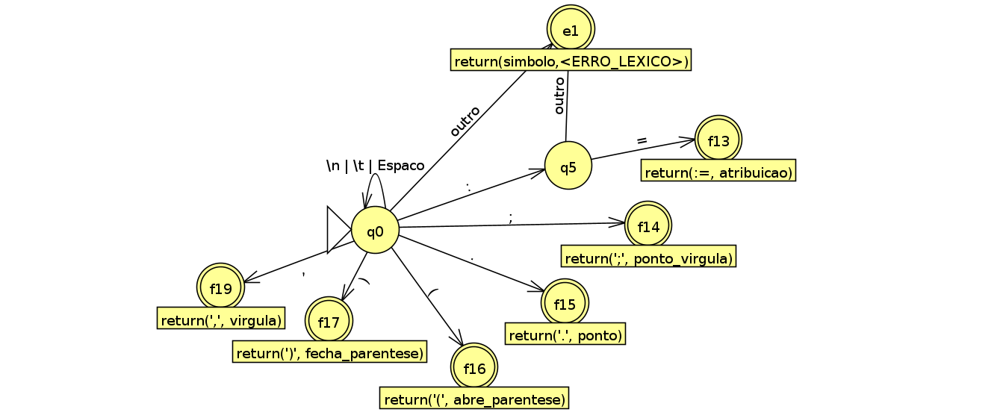
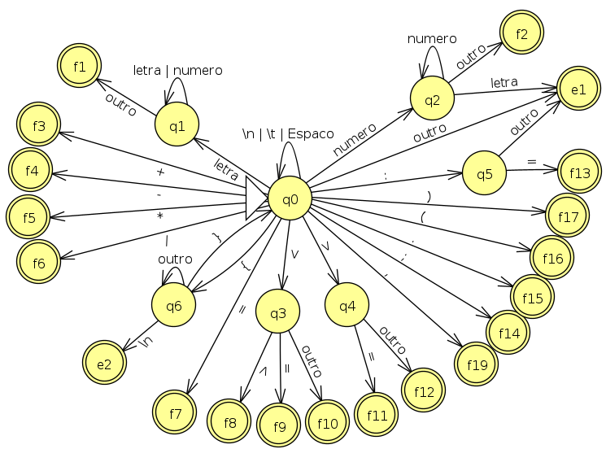

## **O Analisador Léxico**

### 1. **Gramática da linguagem PL/0**
```
<programa> ::= <bloco> .
<bloco> ::= <declaracao> <comando>
<declaracao> ::= <constante> <variavel> <procedimento>
<constante> ::= CONST ident = numero <mais_const> ; | λ
<mais_const> ::= , ident = numero <mais_const> | λ
<variavel> ::= VAR ident <mais_var> ; | λ
<mais_var> ::= , ident <mais_var> | λ
<procedimento> ::= PROCEDURE ident ; <bloco> ; <procedimento> | λ
<comando> ::= ident := <expressao>
| CALL ident
| BEGIN <comando> <mais_cmd> END
| IF <condicao> THEN <comando>
| WHILE <condicao> DO <comando>
| λ
<mais_cmd> ::= ; <comando> <mais_cmd> | λ
<expressao> ::= <operador_unario> <termo> <mais_termos>
<operador_unario> ::= - | + | λ
<termo> ::= <fator> <mais_fatores>
<mais_termos> ::= - <termo> <mais_termos> | + <termo> <mais_termos> | λ
<fator> ::= ident | numero | ( <expressão> )
<mais_fatores> ::= * <fator> <mais_fatores> | / <fator> <mais_fatores> | λ
<condicao> ::= ODD <expressao>
| <expressao> <relacional> <expressao>
<relacional> ::= = | <> | < | <= | > | >=
```

Além disso:
* comentários são de única linha, entre chaves { }
* identificadores são formados por letras e dígitos, começando por letra
* só há números inteiros, formados por um ou mais dígitos (entre 0 e 9)

### 2. **Definição de Tokens**
Baseado-se na gramática, os tokens podem incluir:

- **Palavras-reservadas**: `CONST`, `VAR`, `PROCEDURE`, `CALL`, `BEGIN`, `END`, `IF`, `THEN`, `WHILE`, `DO`, `ODD`
- **Identificadores**: Sequência de letras e dígitos, começando por letra.
- **Números inteiros**: Sequência de um ou mais dígitos.
- **Operadores**: `+`, `-`, `*`, `/`, `=`, `<>`, `<`, `<=`, `>`, `>=`
- **Símboloes especiais**: `:=`, `;`
- **Delimitadores**: `(`, `)`, `,`, `.`
- **Comentários**: `{` até `}` (ignorar o conteúdo)

### 2.1. **Automato para identificadores ou palavras-reservadas**

### 2.2. **Automato para os números inteiros**

### 2.3. **Automato para os operadores aritimeticos**

### 2.4. **Automato para os operadores relacionais**

### 2.5. **Automato para os simbolos especiais e delimitadores**

### 2.6. **Automato para os comentários**

### 2.7. **Automato final**


### 3. **Tabela de estados do automato**
| Estado | Letra | Número | +  | -  | *  | /  | <  | >  | =  | (  | )  | ;  | :  | ,  | .  | {  | }  | \n | \t | Espaço | Outro |
|--------|-------|--------|----|----|----|----|----|----|----|----|----|----|----|----|----|----|----|----|----|--------|-------|
| q0     | q1    | q2     | f3 | f4 | f5 | f6 | q3 | q4 | f7 | f16| f17| f14| q5 | f19| f15| q6 | e1 | q0 | q0 | q0     | e1    |
| q1     | q1    | q1     | f1 | f1 | f1 | f1 | f1 | f1 | f1 | f1 | f1 | f1 | f1 | f1 | f1 | f1 | f1 | f1 | f1 | f1     | f1    |
| q2     | e1    | q2     | f2 | f2 | f2 | f2 | f2 | f2 | f2 | f2 | f2 | f2 | f2 | f2 | f2 | f2 | f2 | f2 | f2 | f2     | f2    |
| q3     | f10   | f10    | f10| f10| f10| f10| f10| f8 | f9 | f10| f10| f10| f10| f10| f10| f10| f10| f10| f10| f10    | f10   |
| q4     | f12   | f12    | f12| f12| f12| f12| f12| f12| f11| f12| f12| f12| f12| f12| f12| f12| f12| f12| f12| f12    | f12   |
| q5     | e1    | e1     | e1 | e1 | e1 | e1 | e1 | e1 | f13| e1 | e1 | e1 | e1 | e1 | e1 | e1 | e1 | e1 | e1 | e1     | e1    |
| q6     | q6    | q6     | q6 | q6 | q6 | q6 | q6 | q6 | q6 | q6 | q6 | q6 | q6 | q6 | q6 | q6 | f18| e2 | q6 | q6     | q6    |


## Rodando e Compilando o programa
### 1. **Requisitos de sistema**
Sistema utilizado --> Linux Ubuntu 22.04
                                                                                    
### 2. **Como rodar o programa**
- Para compilar o programa digite `make` ou `make all` no terminal
- Para rodar basta digitar `make run <nome_do_programa_de_entrada.txt>`,
ja existe um programa teste na pasta que utilizaremos, portanto o comando para rodar fica:
 `make run ARGS=teste.txt`.

#### 2.1 **Saída do programa**
Ao rodar o programa com um arquivo de entrada será gerado um arquivo de saida
chamado `saida.txt` que contem os tokens gerados pelo analizador lexico.

